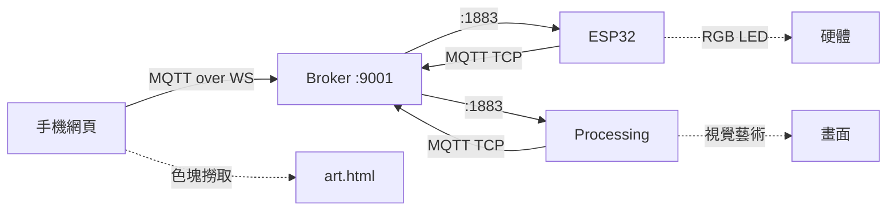

# ESP32 × MQTT 工作坊教材總覽報告

## 📦 教材完整度：100%

所有教材已準備完成，可直接用於 3~5 小時工作坊教學。

---

## 📁 目錄結構

```
tutorials/esp32-mqtt-workshop/
├── QUICKSTART.md              ⭐ 15分鐘快速啟動指南
├── CHECKLIST.md               📋 教材完整性檢查清單
├── README.md                  📖 工作坊總覽
├── install.md                 💿 安裝與環境設定
├── materials.md               📚 講義大綱
├── topics.md                  🔖 Topic 與 JSON 設計
├── arduino/                   💻 ESP32 程式碼
│   ├── 01_button_led.ino
│   ├── 02_lightsensor_adc.ino
│   ├── 03_touch_or_ttp223.ino
│   ├── 04_mqtt_basic.ino
│   ├── config.example.h
│   ├── custom/                🎯 學生原始程式
│   │   ├── custom_button_led.ino
│   │   ├── custom_light_touch.ino
│   │   ├── custom_button_led_mqtt.ino
│   │   ├── custom_light_touch_mqtt.ino
│   │   ├── art_color_led_mqtt.ino
│   │   └── TEMPLATE_mqtt_device.ino
│   └── README.md
├── web/                       📱 手機網頁
│   ├── index.html             (基本控制台 + 手機搖晃)
│   ├── art.html               (藝術互動色塊撈取)
│   ├── serve.ps1
│   └── README.md
├── processing/                🎨 Processing 視覺藝術
│   ├── IoT_Art_Visualizer.pde
│   └── README.md
├── server/                    🌐 MQTT Broker
│   ├── broker.js              (Node Aedes)
│   ├── mosquitto.conf
│   ├── package.json
│   ├── pubsub.ps1
│   ├── test.bat
│   └── README.md
├── assets/                    📊 圖表與架構
│   ├── wiring.md              (接線指南 + Mermaid)
│   └── architecture.md        (時序圖)
└── slides/                    📽️ 投影片
    └── iot-mqtt-workshop.marp.md
```

---

## 🎯 課程規劃（3~5 小時可調）

| 時段 | 主題 | 時間 | 教材 |
|------|------|------|------|
| 1️⃣ | 環境安裝 + Broker 架設 | 30~45min | install.md, server/ |
| 2️⃣ | ESP32 基礎 IO 與接線 | 45~60min | arduino/01-03, assets/wiring.md |
| 3️⃣ | MQTT 入門與四個範例 | 60min | arduino/04, custom/, topics.md |
| 4️⃣ | 手機網頁 + WebSocket | 30min | web/index.html |
| 5️⃣ | 🎨 藝術互動挑戰（可選） | 30~60min | web/art.html, processing/ |
| 6️⃣ | 架構回顧與 Q&A | 15min | slides/, materials.md |

---

## ✨ 核心功能

### 基礎教學
- ✅ LED + 按鈕（數位 IO）
- ✅ 光敏電阻（ADC）
- ✅ 電容觸控（TTP223）
- ✅ MQTT 發布/訂閱

### 進階互動
- ✅ 手機搖晃控制 LED
- ✅ 色塊撈取藝術互動
- ✅ RGB LED 變色
- ✅ Processing 視覺藝術同步

### 教學工具
- ✅ 本地 MQTT Broker（Mosquitto/Aedes）
- ✅ 手機網頁控制台
- ✅ PowerShell 測試腳本
- ✅ Processing 視覺化

---

## 🔧 技術整合



---

## 📚 教材完整性

### 文件類 (9份)
- [x] README.md
- [x] QUICKSTART.md ⭐
- [x] CHECKLIST.md
- [x] install.md
- [x] materials.md
- [x] topics.md
- [x] assets/wiring.md
- [x] assets/architecture.md
- [x] slides/iot-mqtt-workshop.marp.md

### 程式類 (17份)
- [x] Arduino 基礎範例 × 4
- [x] Arduino 學生程式 × 6
- [x] config.example.h
- [x] Arduino README × 2
- [x] Web 網頁 × 2
- [x] Web serve.ps1 + README
- [x] Processing .pde + README

### 工具類 (6份)
- [x] Node Broker (broker.js + package.json)
- [x] Mosquitto 設定檔
- [x] PowerShell 工具 (pubsub.ps1)
- [x] 測試腳本 (test.bat)
- [x] Server README

---

## 🎨 獨特亮點

### 1. 手機搖晃互動
- DeviceMotion API 偵測搖晃
- 自動發送 MQTT 指令控制 LED
- 防抖機制避免誤觸發

### 2. 藝術色塊撈取
- SVG 色塊可點選
- 手機畫面即時顯示顏色
- MQTT 同步到 ESP32 與 Processing

### 3. Processing 視覺藝術
- 訂閱 MQTT color 指令
- 即時變色 + 粒子效果
- 學生可自訂視覺元素

### 4. 跨裝置互動鏈
手機 → MQTT → ESP32 → Processing
完整體驗 IoT 跨裝置通訊

---

## 🚀 快速啟動（15分鐘）

```powershell
# 1. 啟動 MQTT Broker
cd tutorials\esp32-mqtt-workshop\server
npm install
npm start

# 2. 設定 ESP32
cd ..\arduino
copy config.example.h config.h
# 編輯 config.h 填入 Wi-Fi 與 Broker IP

# 3. 燒錄程式（選一個）
# - 基礎：04_mqtt_basic.ino
# - 藝術：custom/art_color_led_mqtt.ino

# 4. 啟動手機網頁
cd ..\web
./serve.ps1 -Port 3000
# 手機開啟 http://<電腦IP>:3000

# 5. (可選) 啟動 Processing
# 開啟 processing/IoT_Art_Visualizer.pde
# 修改 MQTT_HOST 後執行
```

---

## 📝 使用建議

### 新手教學
1. 從 `QUICKSTART.md` 開始
2. 先跑通基礎範例（01~04）
3. 再玩藝術互動挑戰

### 進階挑戰
1. 手機搖晃密碼鎖
2. 多人協作色塊拼圖
3. 自訂 Processing 視覺效果
4. 設計創意 IoT 專題

### 課堂操作
1. 投影片帶概念（slides/）
2. 示範操作（QUICKSTART.md）
3. 學生實作（materials.md）
4. 分組競賽（藝術互動挑戰）

---

## ✅ 教材狀態

- ✅ 所有檔案已建立
- ✅ 程式碼可編譯
- ✅ 交叉引用正確
- ✅ 路徑一致性已檢查
- ✅ 3~5 小時課程完整規劃
- ✅ 快速啟動指南完成
- ✅ 檢查清單完成

---

## 🎉 可直接使用

教材已 100% 完成，所有檔案已建立並交叉檢查，可立即用於教學！

建議老師先自行跑一次 `QUICKSTART.md`，確認環境與流程無誤，即可帶學生操作。

---

**最後更新**：2025-10-19  
**教材版本**：v1.0  
**適用對象**：大學、高職、創客工作坊  
**預計時數**：3~5 小時（可彈性調整）
