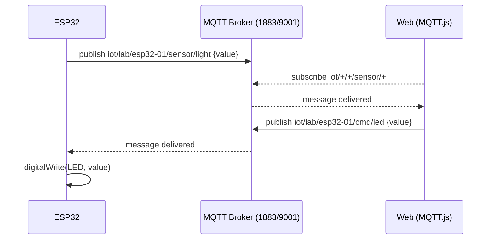

# 架構與資料流

```mermaid
sequenceDiagram
  participant ESP32 as ESP32
  participant MQTT as MQTT Broker (1883/9001)
  participant WEB as Web (MQTT.js)

  ESP32->>MQTT: publish iot/lab/esp32-01/sensor/light {value}
  WEB-->>MQTT: subscribe iot/+/+/sensor/+
  MQTT-->>WEB: message delivered
  WEB->>MQTT: publish iot/lab/esp32-01/cmd/led {value}
  MQTT-->>ESP32: message delivered
  ESP32->>ESP32: digitalWrite(LED, value)
```

- 內網情境下，手機與 ESP32 需在同一 Wi-Fi。
- Web 使用 WebSocket 連線到 Broker 的 9001 連接埠。
- ESP32 透過 TCP 1883 連線。
