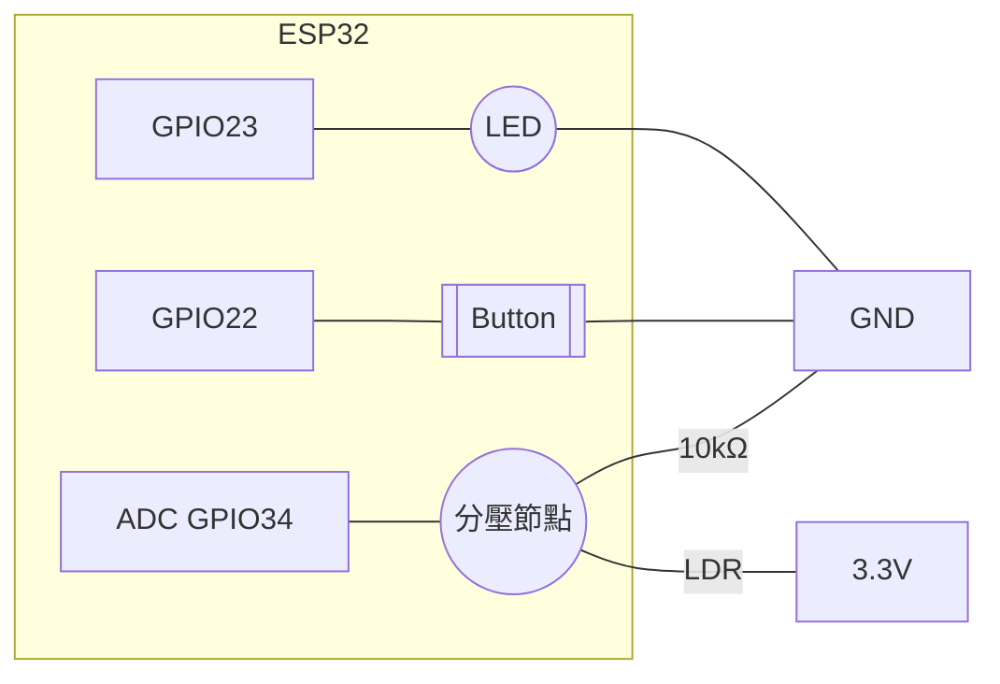

# 接線指南（ESP32）

以下以常見 NodeMCU-32S 腳位為例，實際以你手邊板子腳位為準。

## LED + 按鈕
- LED（帶限流電阻 220~1kΩ）
  - 長腳（正）→ GPIO 23
  - 短腳（負）→ GND
- 按鈕（使用內部上拉或外接電阻）
  - 一端 → GPIO 22
  - 另一端 → GND

注意：若按鈕飄移，可改用 INPUT_PULLUP 並反相讀值。

## 光敏電阻（分壓測量 ADC）
- 光敏電阻（LDR）+ 10kΩ 組成分壓：
  - 3.3V — LDR —(節點)— 10kΩ — GND
  - 節點 → ADC 腳（如 GPIO 34）

## 觸控（TTP223 或 ESP32 觸控腳）
- TTP223 模組 DO 腳 → GPIO 12（或任一數位輸入）
- VCC → 3.3V，GND → GND
- 或改用 ESP32 內建觸控腳（如 T0=GPIO4、T5=GPIO12），以 touchRead 讀值（進階）。

## 參考示意（Mermaid）

